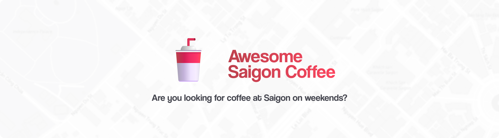

   

<h3 align="center">
  Awesome Saigon Coffee
</h3>

  <small>
    Are you looking for coffee at Saigon on weekends?
  </small>

## Contribute

Welcome to open a pull request to add cafe you have been to. Please obtian the required information and input more other information if useful, and add them to the corresponding [geojson](https://geojson.org/geojson-spec.html).

If your district or province doesn't exist, feel free to create new geojson file. Please refer to [district-1](/district-1.geojson) for the format.

Or you have no idea how geojson work, you can provide me information of your lovely location.

**Required information:**
- `name`: Name of the coffee shop
- `address`: Exact address on map

**Nice to have:**
- `open_time`: Opening time
- `proposed_price`: Average price or minimum price, you can use the prefix: `≥` for minimum price or `~` for average price.
- The shop's official social networking site, can be `instagram` or `facebook`
- `image`: A nice image(s) of the place
- `wifi_speed`: Provide with speed test result

You also can add more additional info if it useful, e.g: How to parking if you go with bike with property `parking_guide`.
